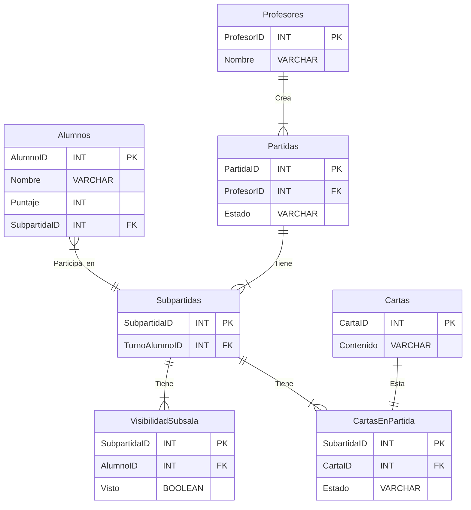

```mermaid
erDiagram
    Profesores {
        ProfesorID INT PK
        Nombre VARCHAR
    }
    Alumnos {
        AlumnoID INT PK
        Nombre VARCHAR
        Puntaje INT
        SubpartidaID INT FK
    }
    Partidas {
        PartidaID INT PK
        ProfesorID INT FK
        Estado VARCHAR
    }
    Subpartidas {
        SubpartidaID INT PK
        TurnoAlumnoID INT FK
    }
    VisibilidadSubsala {
        SubpartidaID INT PK
        AlumnoID INT FK
        Visto BOOLEAN
    }
    Cartas {
        CartaID INT PK
        Contenido VARCHAR
    }
    CartasEnPartida {
        SubartidaID INT PK
        CartaID INT FK
        Estado VARCHAR
    }

    Alumnos }|--|| Subpartidas: Participa_en
    Subpartidas ||--|{ VisibilidadSubsala: Tiene
    Subpartidas ||--|{ CartasEnPartida: Tiene
    Cartas ||--|| CartasEnPartida: Esta
    Partidas ||--|{ Subpartidas: Tiene
    Profesores ||--|{ Partidas: Crea
```
