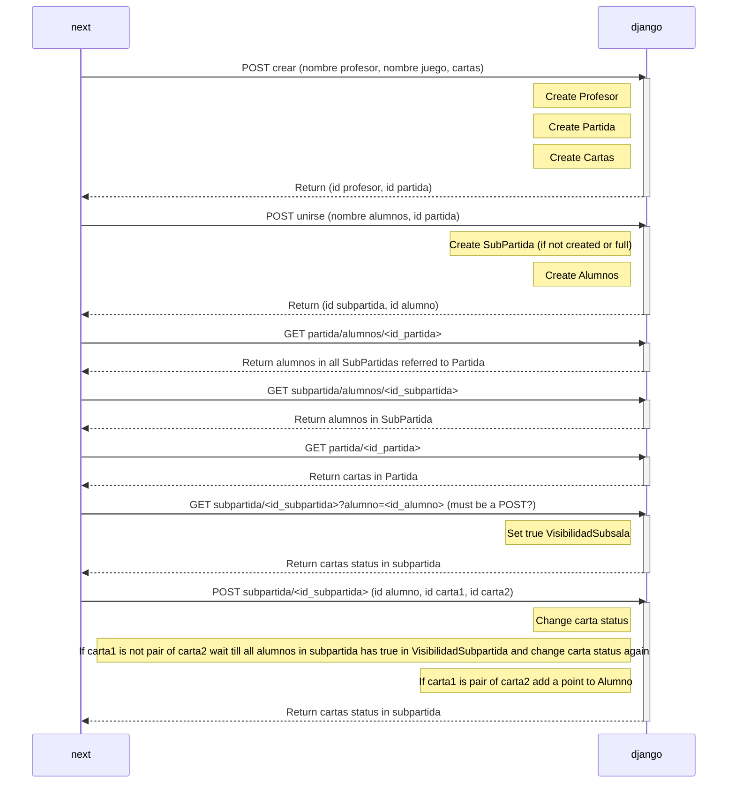

```mermaid
sequenceDiagram
    participant next
    participant django

    next ->> django: POST crear (nombre profesor, nombre juego, cartas)
    activate django

    Note left of django: Create Profesor
    Note left of django: Create Partida
    Note left of django: Create Cartas

    django -->> next: Return (id profesor, id partida)
    deactivate django

    next ->> django: POST unirse (nombre alumnos, id partida)
    activate django

    Note left of django: Create SubPartida (if not created or full)
    Note left of django: Create Alumnos

    django -->> next: Return (id subpartida, id alumno)
    deactivate django

    next ->> django: GET partida/alumnos/<id_partida>
    activate django

    django -->> next: Return alumnos in all SubPartidas referred to Partida
    deactivate django

    next ->> django: GET subpartida/alumnos/<id_subpartida>
    activate django

    django -->> next: Return alumnos in SubPartida
    deactivate django

    next ->> django: GET partida/<id_partida>
    activate django

    django -->> next: Return cartas in Partida
    deactivate django

    next ->> django: GET subpartida/<id_subpartida>?alumno=<id_alumno> (must be a POST?)
    activate django

    Note left of django: Set true VisibilidadSubsala

    django -->> next: Return cartas status in subpartida
    deactivate django

    next ->> django: POST subpartida/<id_subpartida> (id alumno, id carta1, id carta2)
    activate django

    Note left of django: Change carta status
    Note left of django: If carta1 is not pair of carta2 wait till all alumnos in subpartida has true in VisibilidadSubpartida and change carta status again
    Note left of django: If carta1 is pair of carta2 add a point to Alumno

    django -->> next: Return cartas status in subpartida
    deactivate django
```
